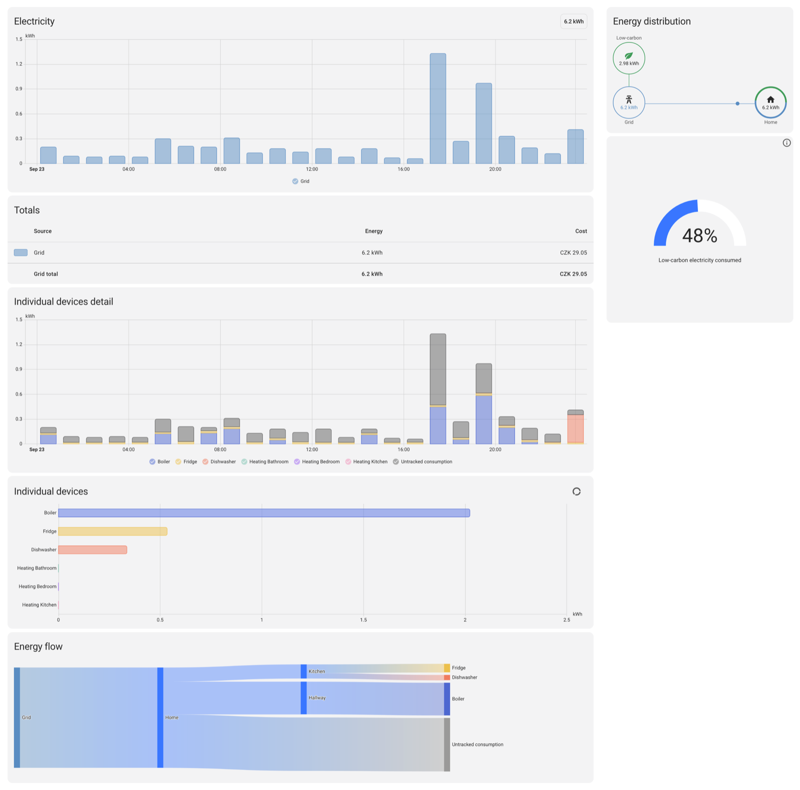

  

  
  
  
  

# EG.D OpenAPI pro Home Assistant

Custom integrace pro Home Assistant, která načítá naměřená data z **EG.D OpenAPI** a importuje je do statistik Home Assistantu jako kumulativní hodnoty energie. Integrace je vhodná pro uživatele s chytrým měřením u EG.D, kteří chtějí mít spotřebu a dodávku elektřiny přímo v Energy dashboardu, statistikách a automatizacích.

## O tomto forku

Fork [JanJakes/ha_egd_openapi](https://github.com/JanJakes/ha_egd_openapi), který
vychází z [CooLajz/ha_egd_openapi](https://github.com/CooLajz/ha_egd_openapi).
Oproti vydání CooLajz `v.1.0.1` přidává:

- opravy z větve `main` CooLajz, které zatím nejsou v žádném jeho vydání,
- podporu chytrých elektroměrů C1 (profily `DCQC`/`DSQC`) a spolehlivější stahování dat (JanJakes),
- načtení celého dne včetně posledního intervalu `23:45` hned při první synchronizaci,
- stavovou třídu `total` u celkových součtů, takže restart ani reload nezpůsobí falešné špičky,
- volitelný výpočet nákladů na odběr, viz [Náklady na odběr](#náklady-na-odběr).

## K čemu integrace slouží

Integrace se připojuje k cloudovému rozhraní EG.D OpenAPI, stahuje profilová data pro zadané odběrné místo a převádí je do formátu, který Home Assistant umí používat jako energetické statistiky.

Typicky ji využijete, pokud chcete:

- zobrazit celkový odběr elektřiny v Home Assistantu,
- zobrazit celkovou dodávku do sítě, například z fotovoltaiky,
- doplnit historická data do statistik Home Assistantu,
- použít data v Energy dashboardu,
- mít přehled o poslední úspěšné synchronizaci a stavu posledních načtených dat.

## Hlavní funkce

- Podpora konfigurace přes grafické rozhraní Home Assistantu.
- Ověření `Client ID` a `Client Secret` už při přidání integrace.
- Načítání dat pro jedno konkrétní odběrné místo podle `EAN`.
- Samostatné nastavení profilu pro odběr a dodávku.
- Automatický denní import dat ve zvolený čas.
- Průběžná zpětná kontrola posledních dnů, aby se opravila opožděně zveřejněná nebo změněná data.
- Import dat do externích statistik Home Assistant Recorderu.
- Volitelný výpočet nákladů na odběr podle entity s cenou elektřiny.
- Zachování mezistavu mezi restarty Home Assistantu.
- Servisní akce pro smazání importovaných statistik a reset lokálního checkpointu.

## Ukázka v Energy dashboardu

Zdrojem odběru ze sítě je externí statistika `ha_egd_openapi:meter_<EAN>_import`
a náklady počítá integrace podle tarifu HDO.

## Co integrace vytváří

Po úspěšném nastavení vzniknou čtyři senzorové entity:

- `Celkový odběr`
- `Celková dodávka`
- `Stav synchronizace`
- `Poslední úspěšná synchronizace`

Entity `Celkový odběr` a `Celková dodávka` mají jednotku `kWh` a jsou určené pro práci s energií v Home Assistantu. Entity `Stav synchronizace` a `Poslední úspěšná synchronizace` jsou diagnostické.

Kromě hlavní hodnoty obsahují i doplňkové atributy, například:

- `ean`
- `last_api_sync_utc`
- `last_update_utc`
- `sync_status`
- `last_error`
- `last_valid_import_timestamp`
- `last_valid_export_timestamp`
- `last_import_status`
- `last_export_status`

Díky tomu snadno poznáte, kdy proběhla poslední synchronizace a jaký byl stav posledního přijatého záznamu z API.

Diagnostická entita `Stav synchronizace` slouží hlavně pro ladění a monitoring. Typicky ukazuje hodnotu:

- `ok` pokud poslední refresh proběhl úspěšně a jsou dostupná očekávaná data,
- `waiting_for_data` pokud EG.D ještě nezveřejnilo nejnovější očekávaný den,
- `error` pokud poslední refresh skončil chybou.

Entita `Poslední úspěšná synchronizace` se aktualizuje pouze tehdy, když integrace skutečně potvrdí dostupnost očekávaných dat. Pokud EG.D ještě nová data nezveřejnilo a stav je `waiting_for_data`, čas poslední úspěšné synchronizace zůstává beze změny.

## Jak integrace funguje

Integrace stahuje data z EG.D OpenAPI po stránkách a při delším období si požadavky sama rozděluje na menší úseky. Záznamy následně seskupuje do hodinových statistik a ukládá je do Home Assistant Recorderu jako kumulativní energetické řady.

Chování synchronizace:

- při prvním spuštění se snaží načíst co největší dostupnou historii v rámci limitů EG.D,
- při dalších spuštěních kontroluje jen poslední konfigurovatelné období zpětně,
- pokud v době plánované synchronizace ještě nejsou k dispozici nejnovější data, průběžný watchdog zkusí načtení zopakovat později.

Započítávají se pouze platné hodnoty (`W`, původní `IU012`). Dočasné (`G`),
chybějící (`F`) a ostatní statusy se nezapočítávají. Pozdější opravy se promítnou
při zpětné kontrole nastaveného období.

## Podporované profily

Profil vyberte podle typu měření odběrného místa:

| Typ měření | Odběr ze sítě | Dodávka do sítě | Zpracování |
| --- | --- | --- | --- |
| **C1 (chytrý elektroměr)** | **`DCQC`** | **`DSQC`** | Energie v kWh, bez převodu. |
| A/B, energie | `ICQ2` | `ISQ2` | Energie v kWh, bez převodu. |
| A/B, výkon | `ICC1` | `ISC1` | Průměrný výkon za 15 minut v kW, převod na kWh dělením čtyřmi. |

Profily a status `W` popisuje [návod EG.D OpenAPI](https://www.egd.cz/sites/default/files/2026-05/uzivatelsky_navod_openapi_abc.pdf).

Profily lze zvolit při přidání integrace i později přes **Konfigurovat**.
Výchozí volby `ICQ2` a `ISQ2` zůstávají zachované; pro C1 vyberte `DCQC` a `DSQC`.
Po změně profilu se znovu načte dostupná historie bez dvojího započítání spotřeby.

U C1 bez přetoků může `DSQC` vracet prázdná data. Odběr se přesto importuje,
ale diagnostika může zůstat ve stavu `waiting_for_data` a čas poslední úspěšné
synchronizace se nemusí posouvat.

## Omezení a specifika EG.D API

Je dobré počítat s několika vlastnostmi zdrojového API:

- EG.D typicky zpřístupňuje data pouze do včerejška, ne do aktuálního dne.
- Poslední dostupný interval dne bývá `23:45`.
- API má klouzavý limit přibližně 3 roky historie.
- Některé profily mají navíc omezený začátek dostupnosti dat.
- Delší časová období se musí stahovat po menších částech.
- Data mohou být zveřejněná se zpožděním, proto existuje zpětná revalidace posledních dnů.

## Požadavky

Pro použití potřebujete:

- funkční Home Assistant s Recorderem,
- přístup do EG.D OpenAPI,
- `Client ID` a `Client Secret`,
- `EAN` odběrného místa, pro které máte oprávnění číst data.

## Instalace

### Instalace přes HACS

1. V HACS otevřete **Custom repositories** a přidejte
   `https://github.com/mstrlc/ha_egd_openapi` s kategorií **Integration**.
2. Vyhledejte integraci `EG.D OpenAPI Integrace pro HomeAssistant`.
3. Nainstalujte ji.
4. Restartujte Home Assistant.

### Přechod z původní integrace (CooLajz)

Konfigurace, entity i statistiky zůstanou zachované.

1. Přidejte tento repozitář do HACS.
2. V HACS odeberte `CooLajz/ha_egd_openapi`. Integraci v Home Assistantu nemažte.
3. Nainstalujte tento fork. Pořadí je důležité, obě používají stejnou složku.
4. Restartujte Home Assistant.

### Ruční instalace

1. Zkopírujte složku `custom_components/ha_egd_openapi` do svého Home Assistant projektu do adresáře `custom_components`.
2. Restartujte Home Assistant.

## Konfigurace v Home Assistantu

Integrace se přidává přes:

`Nastavení` -> `Zařízení a služby` -> `Přidat integraci` -> `EG.D OpenAPI`

### Konfigurační položky

- `Název`: uživatelský název zařízení v Home Assistantu.
- `EAN odběrného místa`: identifikátor odběrného místa.
- `Client ID`: přístupový identifikátor pro EG.D OpenAPI.
- `Client Secret`: tajný klíč pro EG.D OpenAPI.
- `Profil spotřeby`: profil pro odběr.
- `Profil přetoků`: profil pro dodávku.
- `Hodina denní synchronizace`: kdy se má provádět pravidelný denní import.
- `Minuta denní synchronizace`: minuta pravidelné synchronizace.
- `Kolik dnů zpětně kontrolovat`: počet dní, které se mají při každé synchronizaci znovu ověřit.
- `Entita s cenou elektřiny` (volitelné): pro výpočet nákladů na odběr.

### Výchozí hodnoty

- název: `EG.D Smart Meter`
- čas denní synchronizace: `18:40`
- zpětná kontrola: `31` dní
- profil odběru: `ICQ2`
- profil dodávky: `ISQ2`

## Doporučené nastavení

- Denní synchronizaci nastavte na čas, kdy už bývají v EG.D dostupná data za předchozí den (obvykle po 10:00).
- Pokud EG.D někdy doplňuje nebo opravuje data se zpožděním, ponechte zpětnou kontrolu alespoň několik týdnů.
- Jako zdroj odběru ze sítě v Energy dashboardu použijte externí statistiku
  `ha_egd_openapi:meter_<EAN>_import`. Má správně rozdělené hodiny. Entita
  `Celkový odběr` dostane celý den najednou až při synchronizaci.

## Náklady na odběr

Po vyplnění **Entity s cenou elektřiny** (cena za kWh, MWh nebo Wh) integrace zapisuje
statistiku nákladů `ha_egd_openapi:meter_<EAN>_import_cost` v měně Home Assistantu.

V Energy dashboardu ji připojíte u zdroje odběru ze sítě volbou **Použít entitu
sledující celkové náklady**.

Náklad každé hodiny je spotřeba × cena platná v té hodině, včetně přepnutí tarifu
uprostřed hodiny. Ceny se ukládají, takže pozdější opravy dat od EG.D se ocení
původní cenou. Náklady na přetoky se zatím nepočítají.

## Servisní akce

Integrace registruje dvě služby.

### `ha_egd_openapi.force_refresh`

Spustí synchronizaci hned, mimo nastavený denní čas. Volitelné parametry `entry_id`
a `ean` omezí obnovu na jeden konfigurační záznam nebo EAN.

### `ha_egd_openapi.egd_remove_statistics_entity`

Tato služba:

- smaže importované statistiky odběru, dodávky a nákladů,
- odstraní uložené checkpointy integrace,
- vynutí, aby se historie při další synchronizaci znovu sestavila.

Volitelné parametry:

- `entry_id`: smaže statistiky jen pro konkrétní konfigurační záznam,
- `ean`: smaže statistiky jen pro konkrétní EAN.

Použití je vhodné například při:

- změně logiky importu,
- opravě poškozených statistik,
- přepnutí na jiné měřené místo,
- testování nebo ladění integrace.

## Řešení problémů

### Nepodařilo se spojit s API

Zkontrolujte:

- správnost `Client ID`,
- správnost `Client Secret`,
- že máte aktivní přístup do EG.D OpenAPI,
- že API EG.D není dočasně nedostupné.

### Integrace je přidaná, ale nepřichází nová data

Možné příčiny:

- EG.D ještě nezveřejnilo data za předchozí den,
- nastavený čas synchronizace je příliš brzy,
- pro zadaný `EAN` nebo profil nejsou data dostupná,
- poslední záznamy nemají validní stav pro import do statistik.

### Chci nahrát historii znovu

Použijte službu `ha_egd_openapi.egd_remove_statistics_entity` a následně `ha_egd_openapi.force_refresh`.

## Pro koho je integrace vhodná

Integrace je určená hlavně pro uživatele v ČR, kteří:

- mají distribuční území EG.D,
- používají Home Assistant,
- chtějí dlouhodobě ukládat a vyhodnocovat spotřebu nebo dodávku elektřiny,
- chtějí data dostat do nativních statistik Home Assistantu bez ručního importu.
